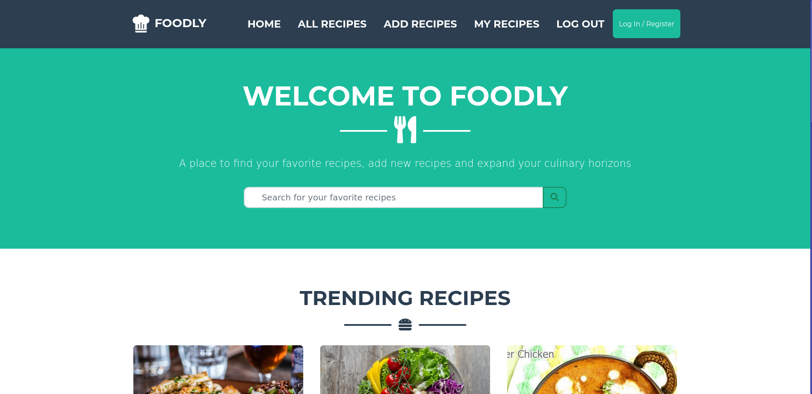
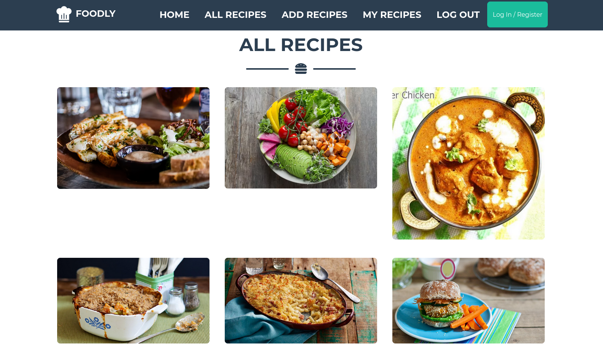
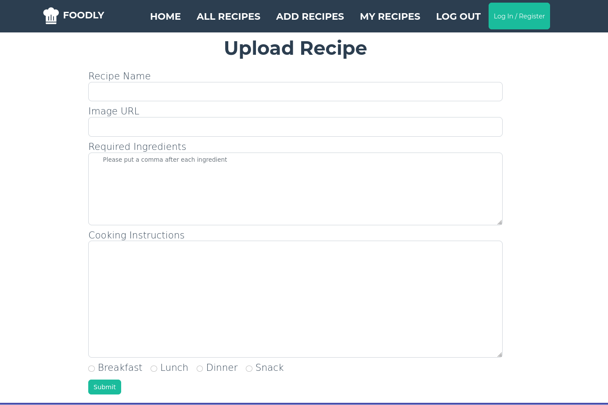
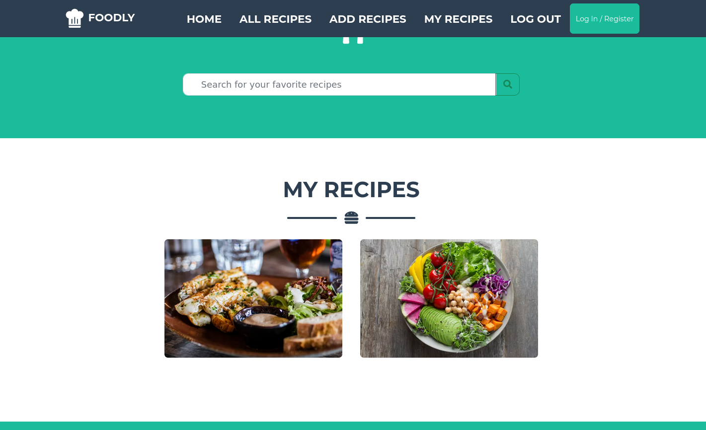
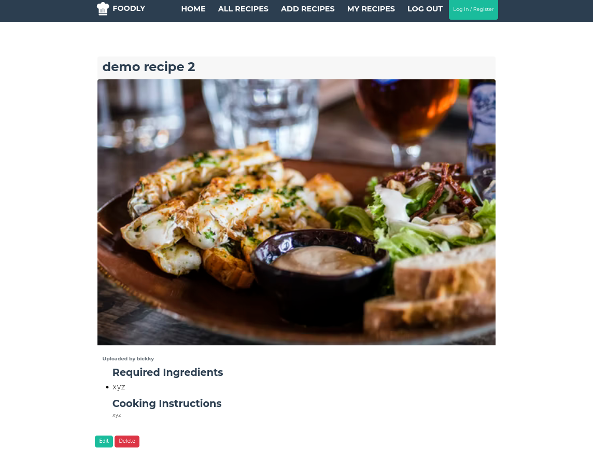
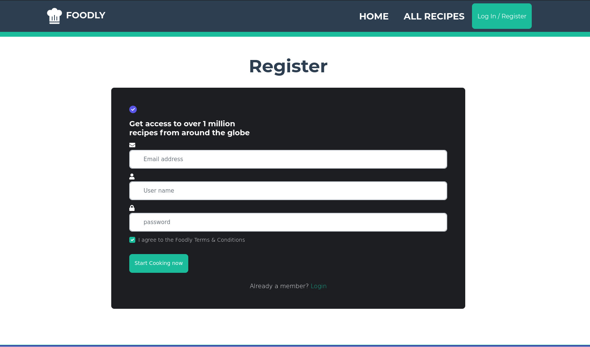
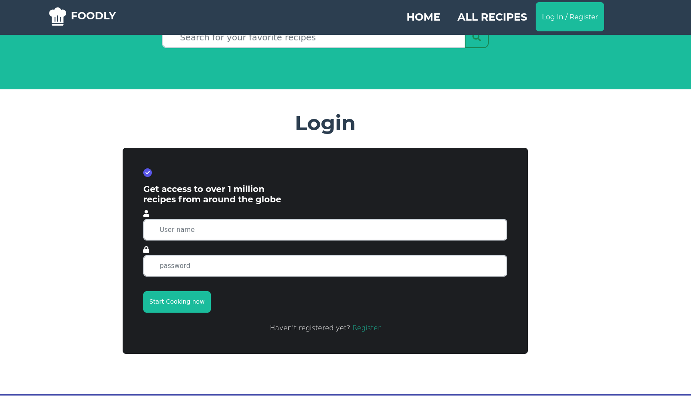

# Foodly Web App
## A foodly web app for food lovers to share their favorite recipes and recipes they have made. 

A Flask web app that allows users to add, edit, and delete recipes. Users can also search for recipes by name, ingredients, and cuisine.


## Features

- Developed using Powerful Flask, MongoDB and Python
- Simple, fast, secured and easy to use application
- Users can add, edit, and delete recipes
- Users can search for recipes by name, ingredients, and cuisine
- Users can view their own recipes
- Users can view other users' recipes
- Very flexible Flask APIs
- Can be hosted easily in cloud


## Tech

Foodly uses a number of open source projects to work properly:

- [Python] - a Powerful Programming Language
- [Flask] - Powerful Python Based Web Framework
- [MongoDB] - NoSQL based Database
- [Bootstrap] - A CSS Framework

## Installation

Foodly App requires [Python](https://python.org/) v3.5+ to run.

Clone the repository first
```sh
git clone https://github.com/bickkysahani/foodly.git
```
and then create virtual environment
```sh
python3 -m venv venv
```
and then activate the virtual environment
```sh
source venv/bin/activate

```
and then install the requirements
```sh
pip install -r requirements.txt
```
and then run the app
```sh
python app.py
```

## Screenshots

Home Page
<br>
All Recipes Page
<br>
Add Recipe Page
<br>
My Recipe Page
<br>
Edit/Delete Recipe Page
<br>
Register Page
<br>
Login Page
<br>

